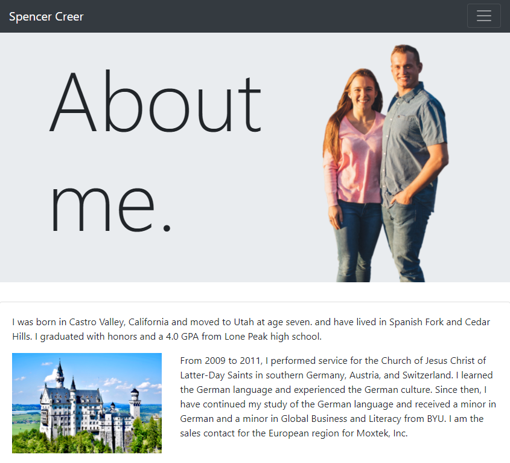
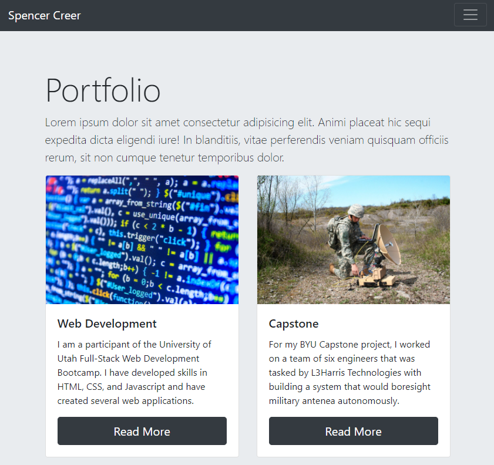
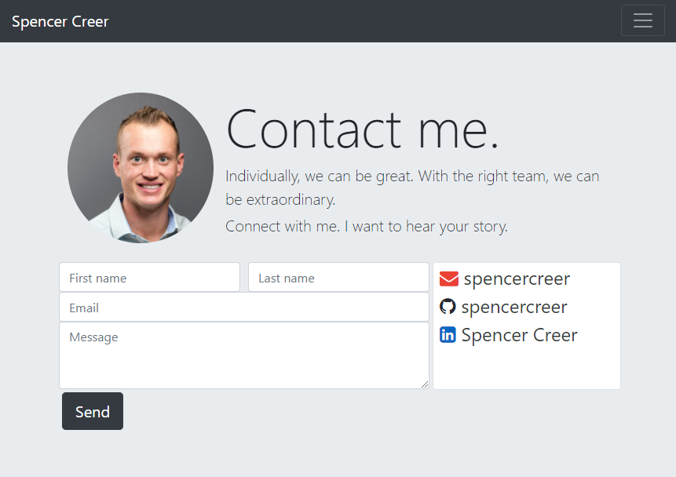

# portfolio
University of Utah bootcamp portfolio

This is a portfolio web application that includes an about me, portfolio, and contact page. It uses bootstrap's grid system to create a responsive layout and img-fluid for responsive images.

## Links

URL: https://spencercreer.github.io/portfolio/

Repository: https://github.com/spencercreer/portfolio

## Images

About me page: 
 

Portfolio page: 

Contact page: 
 

